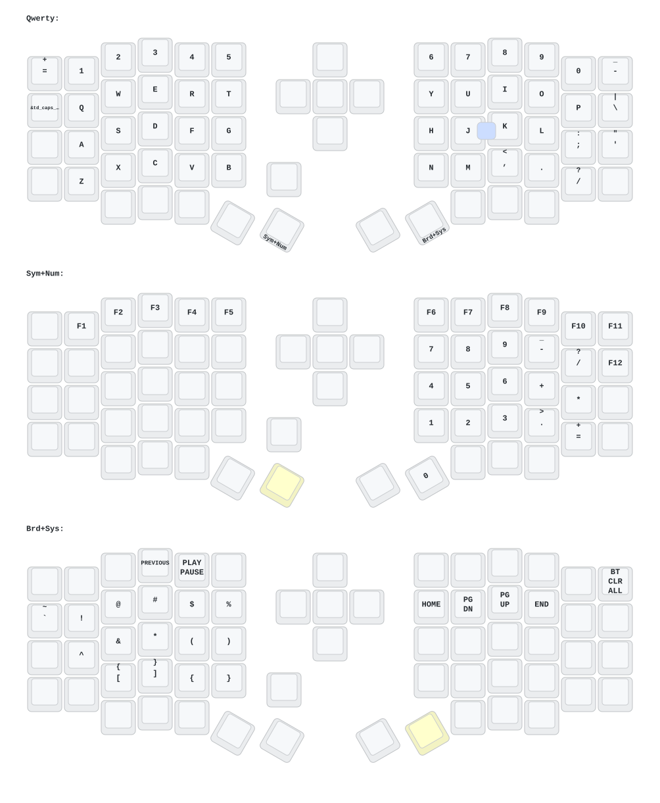

# Sofle 分体人体工学键盘 ZMK 固件配置

这是我的 [Sofle](https://github.com/josefadamcik/SofleKeyboard) 分体式人体工学键盘的个人 ZMK 固件配置。

此配置针对带有 nice!view 屏幕的键盘进行了优化。

## ✨ 主要功能

- **nice!view 屏幕支持**: 显示层信息、连接状态等。
- **省电模式**: 长时间不活动后自动进入睡眠模式。

## 硬件

- Sofle 分体键盘
- nice!nano 控制器
- nice!view 屏幕

## ⌨️ 按键映射 (Keymap)

键盘布局分为多个图层，以便快速访问所有需要的键。

### 第 0 层: 主要 (Main)

这是默认的基础图层，包含标准的字母和修饰键。

- **长按/短按**:
    - `ESC` / `=`
    - `Shift` / `Backspace`
    - `Alt` / `Z`
    - `Ctrl` / `Tab`
- **图层切换**:
    - `ENTER` (长按切换到第 1 层)
    - `SPACE` (长按切换到第 2 层)

### 第 1 层: 符号与数字 (Sym+Num)

此图层包含数字、F键和常用符号。

### 第 2 层: 系统与媒体控制 (Brd+Sys)

此图层用于控制系统功能、媒体播放和 RGB 灯效。

- **蓝牙控制**: `BT_PRV`, `BT_NXT`, `BT_CLR`
- **RGB 控制**: `RGB_TOG`, `RGB_EFF`, `RGB_BRI`, `RGB_BRD`
- **媒体键**: `C_VOLUME_DOWN`, `C_VOLUME_UP`, `K_MUTE`, `K_PLAY_PAUSE`
- **系统**: `sys_reset`

## 📁 文件结构

- **`build.yaml`**: GitHub Actions 配置文件，用于自动化构建固件。
- **`keymap_drawer.config.yaml`**: `keymap-drawer` 工具的配置文件，用于生成按键映射图。
- **`boards/`**: 存放键盘硬件定义文件。
    - **`arm/eyelash_sofle/`**: `eyelash_sofle` 分体键盘的硬件定义，包括 DTS、引脚配置等。
- **`config/`**: ZMK 固件的核心配置文件。
    - **`eyelash_sofle.conf`**: 固件功能开关，如屏幕、RGB 灯效等。
    - **`eyelash_sofle.keymap`**: 按键映射定义文件，包含所有图层和按键绑定。
    - **`west.yml`**: `west` 工具的清单文件，用于管理 ZMK 项目依赖。
- **`keymap-drawer/`**: 存放 `keymap-drawer` 生成的布局图和相关配置文件。
- **`zephyr/`**: Zephyr RTOS 模块定义文件。

## 🤖 Agent 文档约定

- **`CLAUDE.md`**: 面向 Claude Code 的唯一项目规则真源（Single Source of Truth）。
- **`AGENTS.md`**: 仅保留 `CLAUDE.md` 指向，用于兼容不同 Agent 入口。
- 修改 Agent 协作规则时，请优先更新 `CLAUDE.md`。

## 🛠️ 构建与刷写 (Build & Flash)

推荐使用 `mise` 统一管理本地工具链和构建任务（GitHub Actions 编译流程保持不变）。

1. **安装工具链**:
    在项目根目录执行：
    ```bash
    mise install
    ```

2. **首次初始化 ZMK workspace**:
    ```bash
    mise run setup
    ```

3. **构建固件**:
    ```bash
    # 编译左右手
    mise run build-all

    # 或分别编译
    mise run build-left
    mise run build-right

    # 左手 Studio 版本
    mise run build-left-studio
    ```

4. **清理本地产物**:
    ```bash
    mise run clean
    ```

5. **刷写固件**:
    将控制器置于引导加载程序模式，然后将 `.uf2` 文件复制到控制器：
    - `build/left/zephyr/zmk.uf2`
    - `build/right/zephyr/zmk.uf2`
    - Studio 构建使用 `build/left-studio/zephyr/zmk.uf2`

> `build/` 目录已加入 `.gitignore`，本地编译产物不会被提交。

如果需要直接调试 `west` 命令，可使用以下等价命令：

```bash
west build -s zmk/app -d build/left -b eyelash_sofle_left -- -DSHIELD=eyelash_sofle_left -DZMK_CONFIG=$PWD/config
west build -s zmk/app -d build/right -b eyelash_sofle_right -- -DSHIELD=eyelash_sofle_right -DZMK_CONFIG=$PWD/config
```

## 🗺️ 键盘布局图 (Keymap Drawer)

本项目包含一个 `keymap-drawer` 配置，可以生成键盘布局的 SVG 图像。

要生成布局图，请运行：
```bash
keymap-drawer -c keymap_drawer.config.yaml
```
生成的 `eyelash_sofle.svg` 文件将位于 `keymap-drawer/` 目录下。

当 `eyelash_sofle.svg` 文件更新并提交到版本库后，下方显示的键盘布局图也会自动更新。


